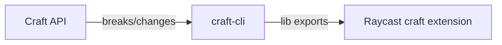

# craft-cli

## Update chain

- source of truth: Craft's OpenAPI spec at `~/dev/craft-docs/craft-do-api/craft-do-openapi.json`
- craft-cli (`~/dev/tools/craft-cli/`) - wraps raw API, handles caveats
- raycast extension (`~/dev/raycast/craft/`) - imports `@1ar/craft-cli/lib`, never calls API directly
- when Craft changes endpoints: update cli first, then raycast follows

## Non-obvious

- compiled bun binary, not ts-node. `bun run build` after changes, binary at `dist/craft`
- `src/lib/` = reusable client (CraftClient class). `src/cli/` = arg parsing + rendering. keep them decoupled
- API caveats tracked at `~/dev/craft-docs/craft-do-api/trials/CAVEATS.md` - read before assuming API behavior
- backlinks: not a real API feature. faked via title-based search + `block://` URI filtering. fragile by design
- `blocks insert` requires explicit target - the API silently routes orphan inserts to daily note, cli rejects that
- search defaults to `regexps` mode (RE2). `include` mode silently drops underscored tokens
- exit codes: 0 ok, 1 user error, 2 api error, 3 auth, 4 not found
- tests: `bun test` (unit), `bun test tests/integration` (needs CRAFT_URL+CRAFT_KEY)

## Standing rules

- after any CLI surface change (new command, changed flags, new output format): update the craft-cli skill at `~/.claude/skills/craft-cli/` to match. skill is the AI's primary discovery mechanism - stale skill = broken AI workflows
- after any CLI change: rebuild binary (`bun run build`), run tests, verify skill still accurate
