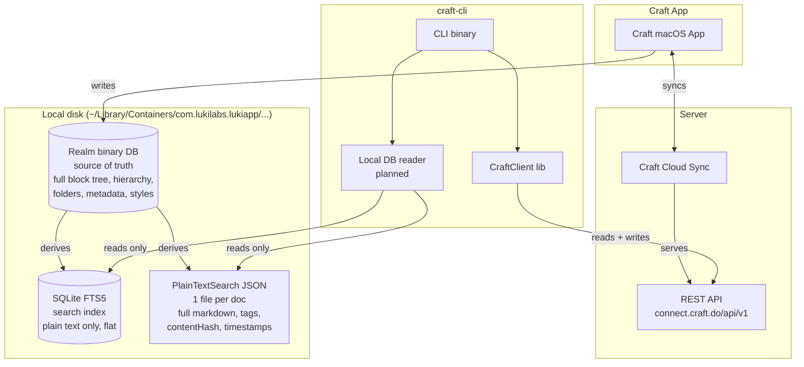

# craft-cli

CLI wrapper over the [Craft Docs](https://www.craft.do/) "API for All Docs".

## What this is

An AI-native CLI for the Craft Docs API. The primary goal is to make Craft content as easy to read and edit from AI coding agents (Claude Code, Codex, OpenCode, etc.) as local files are in tools like Obsidian.

The CLI handles the API's footguns and undocumented behaviors internally - rate limits, inconsistent payload keys, silent routing of unanchored inserts, missing `content` keys at depth 0, RE2 regex edge cases, backlink resolution via title search - so that agents and scripts don't have to.

Built with Bun. Ships as a single compiled binary. Also exports a TypeScript library for programmatic use.

## Why this exists

Craft has a solid API but no official CLI. AI agents need a fast, predictable, scriptable interface to work with Craft content at the same speed they work with local files. This fills that gap.

## Distribution

This is a personal tool published as-is. I don't work for Craft and don't plan to maintain package manager distributions (Homebrew, npm global, etc.). If Craft wants to adopt or fork this into an official CLI, they're welcome to.

Install from source (see below).

## Install

```sh
git clone https://github.com/pa1ar/craft-cli.git
cd craft-cli
bun install
bun run build
```

The build produces a compiled binary at `dist/craft`. Symlink it somewhere on your PATH:

```sh
ln -sf "$PWD/dist/craft" ~/.local/bin/craft
```

## Setup

```sh
craft setup --url "https://connect.craft.do/links/XXX/api/v1" --key "pdk_..."
craft whoami
```

Credentials stored at `~/.config/craft-cli/config.json` (mode 0600). Env overrides: `CRAFT_URL`, `CRAFT_KEY`, `CRAFT_PROFILE`.

## Commands

```
craft whoami                     identity and space info
craft profiles list              manage multiple spaces

craft folders ls                 folder tree
craft folders mk / rm            create / delete folders

craft docs ls                    list documents (filter by folder/location)
craft docs search "regex"        search by content (RE2 regex or phrase match)
craft docs get <id>              render doc as markdown (includes backlinks)
craft docs daily [DATE]          today's daily note
craft docs mk / mv / rm          create / move / trash documents
craft docs open <id>             print deeplink and open in Craft app

craft blocks get <id>            read a block tree
craft blocks search <doc> "re"   search within a document
craft blocks append <doc> --markdown "text"
craft blocks append --date today --markdown "text"
craft blocks insert / update / mv / rm

craft tasks ls inbox|active|upcoming|logbook
craft tasks add / update / rm

craft col ls / schema / items    collections and structured data
craft col items add / update / rm

craft links out <id>             outgoing links (parsed from markdown)
craft links in <id>              backlinks (title-based vault search)

craft upload <file> --parent <doc>
craft comment <id> "text"
craft wb mk / el add / el get / el update / el rm

craft raw GET|POST|... /path     escape hatch for any API endpoint
```

Global flags: `--json`, `--profile NAME`, `--quiet`, `--depth N`, `--no-links`.

## Architecture

### How Craft stores data locally

Based on reverse-engineering Craft's local data stores (2026-04-06). This is not official documentation - Craft can change any of this without notice.



### Where data lives

| Data | Realm (binary) | SQLite FTS5 | PlainTextSearch JSON | REST API |
|------|:-:|:-:|:-:|:-:|
| block hierarchy (parent-child tree) | yes | no (flat) | no (flat markdown) | yes |
| block markdown with formatting | yes | **no** (plain text) | **yes** (full markdown) | yes |
| block IDs | yes | yes | no | yes |
| document title | yes | yes (content column) | yes | yes |
| document tags | yes | no | **yes** (tags[]) | no (parse from content) |
| isDailyNote flag | yes | no | **yes** | no |
| modification timestamp | yes | no | **yes** (NSDate) | yes (fetchMetadata) |
| last viewed timestamp | yes | no | **yes** | no |
| contentHash (change detection) | yes | no | **yes** | no |
| folder structure | yes | no | no | yes |
| collection/database schema | yes | no | no | yes |
| block styles (color, font, list) | yes | no | no | yes |
| full-text search index | no | **yes** (FTS5) | no | yes (RE2 regex) |
| queryable from CLI | no (binary) | **yes** (bun:sqlite) | **yes** (JSON.parse) | **yes** (HTTP) |
| writable from CLI | no | no | no | **yes** (only path) |

### How craft-cli uses this

**Current (v0.1):** API-only. All reads and writes go through the REST API.

**Planned (hybrid mode):** Reads from local SQLite + PlainTextSearch JSON when available (instant, offline-capable). Writes always go through the API (server-validated, synced). Falls back to API-only when local data is absent (non-Mac, Craft not installed). The `--api` flag forces API-only mode.

Key insight: the API is the only write path, but local data stores enable instant search, change detection via contentHash, and document-level reads without network calls.

## Library usage

```ts
import { CraftClient } from "@1ar/craft-cli/lib";

const craft = new CraftClient({ url: process.env.CRAFT_URL!, key: process.env.CRAFT_KEY! });
const hits = await craft.documents.search({ regexps: "LTM|memory" });
const doc = await craft.blocks.get(hits.items[0]!.documentId, { format: "markdown" });
```

## Downstream consumers

- [Raycast extension](https://github.com/pa1ar/raycast-craft-api) - imports `CraftClient` from this library for a native macOS Raycast UI
- Claude Code skill (`~/.claude/skills/craft-cli/`) - teaches AI agents to use the CLI

## License

MIT
