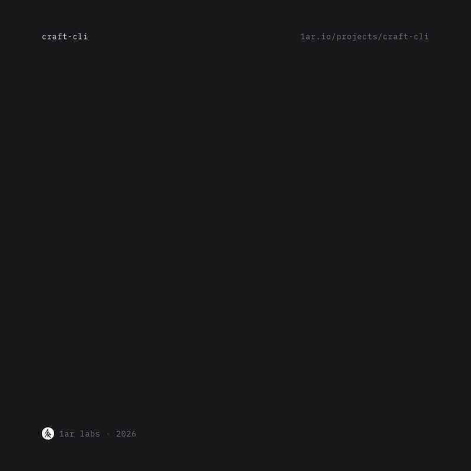
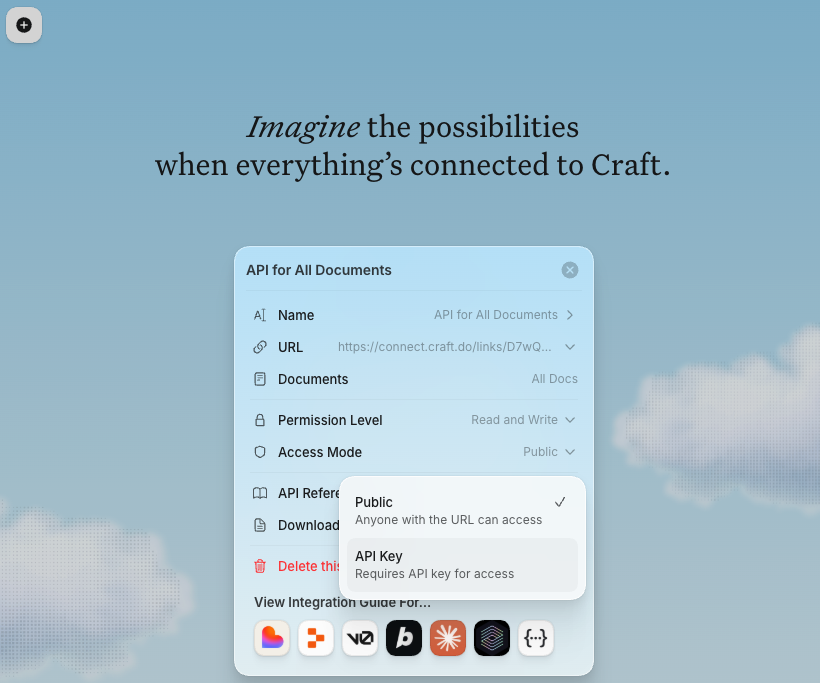
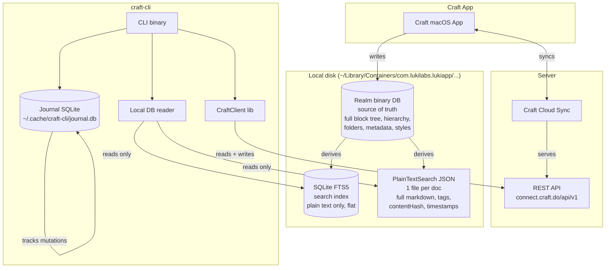

# craft-cli

CLI wrapper over the [Craft Docs](https://www.craft.do/) "API for All Docs".

Single-binary Bun CLI, AI-agent-first, runs on macOS and Linux. Also exports a TypeScript library for Raycast and Node scripts.

> Unofficial. Not affiliated with Craft Docs.



---

## Install (paste this to your AI agent)

To install craft-cli, paste the block below into your AI coding agent (Claude Code, Codex, OpenCode, Cursor, etc.). The agent will handle clone, build, install, authentication, and skill registration.

```text
You are installing craft-cli (https://github.com/pa1ar/craft-cli) for me. Follow these steps in order. Stop and ask me if anything is ambiguous, otherwise proceed end-to-end.

1. RUNTIME CHECK
   Check whether `bun` is on PATH. If yes, continue.
   If not:
     - If I have a stated package-manager preference, use that.
     - Otherwise, install Bun: `curl -fsSL https://bun.sh/install | bash` (do not switch to npm/pnpm/yarn — this project is Bun-first; the build script and binary path assume Bun).

2. CLONE + BUILD + INSTALL
   git clone https://github.com/pa1ar/craft-cli.git ~/dev/craft-cli
   cd ~/dev/craft-cli && ./install.sh
   If `install.sh` fails or is unavailable, fall back to:
     bun install && bun run build
     mkdir -p ~/.local/bin && ln -sf "$PWD/dist/craft" ~/.local/bin/craft
   Verify `~/.local/bin` is on PATH. Add it to my shell rc if missing (detect zsh vs bash from $SHELL).

3. AUTHENTICATE
   Ask me for the Craft API URL and API key. I get them from Craft → Imagine → New API Connection. The URL looks like `https://connect.craft.do/links/XXX/api/v1`, the key starts with `pdk_`.
   Then run: craft setup --url "<URL>" --key "<KEY>"

4. SOURCE (Linux / headless only)
   If this host has no Craft desktop app (any Linux box, any remote/headless server), persist API-only source: `craft source api`. On macOS with the Craft app installed, skip this — `source auto` is the default and reads local first.

5. VERIFY
   craft whoami            # confirms auth works
   craft docs ls --limit 3 # confirms reads work

6. SKILL REGISTRATION
   The repo ships an agent skill at `skill/SKILL.md` — full command surface, recipes, caveats. Register it with this host so you can load it on demand:
     - Claude Code: `install.sh` already symlinked it to `~/.claude/skills/craft-cli`. Done.
     - Codex CLI: symlink `~/dev/craft-cli/skill` to `~/.codex/skills/craft-cli` (create dir if missing).
     - OpenCode / Cursor / other: place the skill where this host loads agent skills from. If you do not know the canonical path for this host, ask me.
   After registration, read `skill/SKILL.md` once before you write any craft-* commands — it contains the precedence rules, exit codes, and the gotchas that the API does not document.

7. REPORT BACK
   Tell me:
     - which source is active (auto vs api vs local),
     - where the binary landed,
     - where the skill is registered,
     - any step you skipped and why.
```

---

## For humans

An AI-native CLI for the Craft Docs API. The primary goal is to make Craft content as easy to read and edit from AI coding agents (Claude Code, Codex, OpenCode, etc.) as local files are in tools like Obsidian.

The CLI handles the API's footguns and undocumented behaviors internally - rate limits, inconsistent payload keys, silent routing of unanchored inserts, missing `content` keys at depth 0, RE2 regex edge cases, backlink resolution via title search - so that agents and scripts don't have to.

Built with Bun. Ships as a single compiled binary. Also exports a TypeScript library for programmatic use.

## Why this exists

Craft has a solid API but no official CLI. AI agents need a fast, predictable, scriptable interface to work with Craft content at the same speed they work with local files. This fills that gap.

## Distribution

This is a personal tool published as-is. I don't work for Craft and don't plan to maintain package manager distributions (Homebrew, npm global, etc.). If Craft wants to adopt or fork this into an official CLI, they're welcome to.

Install from source: see the install block above.

## Setup

### Getting your API key

1. Open the Craft app (macOS/iOS) or [craft.do](https://www.craft.do/) in a browser
2. Go to **Imagine** (the integrations panel)
3. Click the **+** button (top left) and select **New API Connection**
4. Choose which documents will be accessible via this connection
5. Switch **Access Mode** from "Public" to **API Key**
6. Click **+** next to "API Keys", enter a name, and click **Create**
7. Copy the key immediately - you won't see it again
8. Copy the **URL** from the connection panel



Then run:

```sh
craft setup --url "https://connect.craft.do/links/XXX/api/v1" --key "pdk_..."
```

Credentials stored at `~/.config/craft-cli/config.json` (mode 0600). Env overrides: `CRAFT_URL`, `CRAFT_KEY`, `CRAFT_PROFILE`, `CRAFT_SOURCE` (see [Read source](#how-craft-cli-uses-this)), legacy `CRAFT_MODE`, `CRAFT_LOCAL_PATH`.

On Linux or any host where Craft is not installed, run `craft source api` after setup to skip local-store discovery entirely.

## Commands

```
craft whoami                     identity and space info
craft doctor --json              auth/API/source/local health check
craft agent-context              JSON manifest for agents
craft which <capability>         find command for an intent
craft profiles list              manage multiple spaces
craft source [auto|api|local]    show or persist read source (auto default)

craft folders ls                 folder tree
craft folders mk / rm            create / delete folders

craft docs ls                    list documents (filter by folder/location)
craft docs search "regex"        search by content (RE2 regex or phrase match)
craft docs get <id>              render doc as markdown (includes backlinks)
craft docs daily [DATE]          today's daily note
craft docs mk / mv / rm          create / move / trash documents
craft docs open <id>             print deeplink and open in Craft app

craft blocks get <id>            read a block tree
craft blocks search <doc> "re"   search within a document
craft blocks append <doc> --markdown "text"
craft blocks append --date today --markdown "text"
craft blocks insert / update / mv / rm

craft tasks ls inbox|active|upcoming|logbook
craft tasks add / update / rm

craft col ls / schema / items    collections and structured data
craft col items add / update / rm

craft links out <id>             outgoing links (parsed from markdown)
craft links in <id>              backlinks (title-based vault search)

craft upload <file> --parent <doc>
craft comment <id> "text"
craft wb mk / el add / el get / el update / el rm

craft patch <doc> --old STR --new STR  find and replace in blocks
craft cat <id> [id...]               read multiple docs at once
craft diff <id>                      compare to last known state
craft undo [id] [--force]            revert last mutation
craft log [id] [--last N]            mutation history

craft raw GET|POST|... /path     escape hatch for any API endpoint

craft skills ls/search/show      discover bundled + ~/.craft-cli/skills automations
craft skills validate <path|name>
craft skills run <name> <command> [...args] [--estimate] [--max-cost EUR]
craft media analyze <blockId>    analyze Craft media with bundled media-analyze skill
```

Global flags: `--json`, `--select id,title`, `--profile NAME`, `--quiet`, `--depth N`, `--no-links`, `--source auto|api|local`, `--api`, `--dry-run` on writes.

## Skills

`craft skills` is a demand-loaded automation layer. V1 discovers curated bundled repo skills plus explicit local skills from `~/.craft-cli/skills`; there is no remote/community install flow. Search is manifest keyword search over name, description, tags, and commands.

```sh
craft skills ls
craft skills search media
craft skills show media-analyze
craft skills validate media-analyze
craft skills run media-analyze analyze <blockId> --estimate
```

Skills run as subprocesses with structured JSON stdin/stdout. The skill can propose writes, but `craft-cli` owns all Craft writes and journal integration.

### Media analysis

```sh
craft media analyze <blockId>
craft media analyze <blockId> --estimate
craft media analyze <blockId> --max-cost 0.50 --json
```

`craft media analyze` is a curated alias for `craft skills run media-analyze analyze <blockId>`. V1 is generic media analysis only, OpenAI-first, with a default EUR 1 cap. Useful artifacts are written into a Craft-visible run block under the source block: final analysis, transcript text when available, contact-sheet path, metadata JSON, model/cost metadata, and failure/partial status. Raw intermediate media files stay in `~/.cache/craft-cli/media-analyze`.

## Why this is faster than the API or MCP

craft-cli uses a hybrid read architecture on macOS: reads from Craft's local SQLite FTS5 index and PlainTextSearch JSON files, writes through the REST API. Both local stores update within 1 second of any write (API or Craft app), so data is always fresh.


```mermaid
flowchart LR
    subgraph READ ["READ (local, ~1ms)"]
        direction TB
        R1[craft docs ls] --> SQLite[(SQLite FTS5)]
        R2[craft docs search] --> SQLite
        R3[craft diff] --> JSON[(PlainTextSearch JSON)]
    end

    subgraph WRITE ["WRITE (API, ~500ms)"]
        direction TB
        W1[craft blocks update] --> API[Craft REST API]
        W2[craft patch] --> API
        W3[craft undo] --> API
    end

    API -->|"syncs ~1s"| Craft[Craft App]
    Craft -->|derives| SQLite
    Craft -->|derives| JSON

    WRITE --> Journal[(Journal SQLite)]
    Journal --> READ

    style READ fill:#1a3a1a,stroke:#4a8a4a
    style WRITE fill:#3a1a1a,stroke:#8a4a4a
```

On average, local reads are **~3,600x faster** than API calls. A 10-step AI workflow that takes ~25s via API completes in ~200ms locally.

### Benchmarks (1ar vault, ~1,200 docs, ~46,000 blocks)

| Operation | REST API | Craft MCP | craft-cli (local) | craft-cli (API fallback) | Speedup |
|---|---|---|---|---|---|
| Search vault for a term | 2,271ms | 2,271ms + MCP hop | **1.3ms** | 2,271ms | **1,700x** |
| Read document content | 4,561ms | 4,561ms + MCP hop | **0.7ms** | 4,561ms | **6,300x** |
| Check if doc changed | 3,247ms (full fetch) | 3,247ms + MCP hop | **0.5ms** (contentHash) | 3,247ms | **6,600x** |
| List all documents | 1,489ms | 1,489ms + MCP hop | **184ms** | 1,489ms | **8x** |

Methodology: 5 iterations each, wall-clock time, same machine. API = Craft REST API via HTTP. MCP = same API + MCP protocol overhead. Local = bun:sqlite FTS5 queries + JSON file reads. See `docs/local-performance-results.md` for raw data.

### Why not just use the API?

The API is the only write path and the authoritative source for block hierarchy. But for reads:

| Dimension | REST API / MCP | craft-cli hybrid |
|---|---|---|
| Read latency | 150ms - 4.5s per call | <1ms - 184ms (local SQLite + JSON) |
| Search reliability | `regexps` mode misses short terms | FTS5 finds them (unicode61 tokenizer) |
| Change detection | must fetch full doc to compare | `contentHash` field, single JSON read |
| Offline reads | no | yes (local data stores) |
| Rate limits | yes (though generous) | no (local reads are free) |
| Context window cost | verbose JSON responses | compact markdown or `--json` on demand |
| Backlinks | not supported natively | faked via title search + block:// filter |
| Mutation history | none | SQLite journal with diff/undo/log |

### Why not just use local files (Obsidian-style)?

Local markdown vaults (Obsidian, etc.) are the gold standard for AI file editing - instant read/write, `grep`, `git diff`. But Craft's block model doesn't map cleanly to flat markdown: nested pages, cards, collections, styled blocks, tasks with scheduling all lose structure. Mirroring to files creates a cache invalidation nightmare without webhooks.

craft-cli takes a different approach: read from Craft's own local data stores (which Craft keeps in sync), write through the API. No mirroring, no sync to manage, no structure loss.

| Dimension | Local MD (Obsidian) | craft-cli |
|---|---|---|
| Read speed | <1ms | <1ms (local), 150ms-4.5s (API fallback) |
| Write speed | <1ms | 200-800ms (API, server-validated) |
| Rich content (cards, tasks, collections) | no | yes (full block model) |
| Sync to Craft app | none | instant (API writes sync, local reads from Craft's DB) |
| Change detection | `git diff` | `contentHash` + journal-based `craft diff` |
| Undo | `git checkout` | `craft undo` (journal-based, read-before-write safety) |
| Surgical edit | Edit tool (line-based) | `craft patch` (block-based, same find-and-replace pattern) |

### Sync timing

Both local data stores (SQLite FTS5 and PlainTextSearch JSON) update within 1 second of a write via the API or the Craft app. Verified by appending a marker block via API and polling local file modification times. Craft app must be running for sync to occur.

## Architecture

### How Craft stores data locally

Based on reverse-engineering Craft's local data stores (2026-04-06). This is not official documentation - Craft can change any of this without notice.


```mermaid
graph TD
    subgraph "Craft App"
        APP[Craft macOS App]
    end

    subgraph "Server"
        SYNC[Craft Cloud Sync]
        API[REST API<br/>connect.craft.do/api/v1]
    end

    subgraph "Local disk (~/Library/Containers/com.lukilabs.lukiapp/...)"
        REALM[(Realm binary DB<br/>source of truth<br/>full block tree, hierarchy,<br/>folders, metadata, styles)]
        SQLITE[(SQLite FTS5<br/>search index<br/>plain text only, flat)]
        JSON[PlainTextSearch JSON<br/>1 file per doc<br/>full markdown, tags,<br/>contentHash, timestamps]
    end

    APP -->|writes| REALM
    REALM -->|derives| SQLITE
    REALM -->|derives| JSON
    APP <-->|syncs| SYNC
    SYNC -->|serves| API

    subgraph "craft-cli"
        CLI[CLI binary]
        LIB[CraftClient lib]
        LOCAL[Local DB reader]
        JOURNAL[(Journal SQLite<br/>~/.cache/craft-cli/journal.db)]
    end

    CLI --> LIB
    CLI --> LOCAL
    CLI --> JOURNAL
    LIB -->|reads + writes| API
    LOCAL -->|reads only| SQLITE
    LOCAL -->|reads only| JSON
    JOURNAL -->|tracks mutations| JOURNAL
```

### Where data lives

| Data | Realm (binary) | SQLite FTS5 | PlainTextSearch JSON | REST API |
|------|:-:|:-:|:-:|:-:|
| block hierarchy (parent-child tree) | yes | no (flat) | no (flat markdown) | yes |
| block markdown with formatting | yes | **no** (plain text) | **yes** (full markdown) | yes |
| block IDs | yes | yes | no | yes |
| document title | yes | yes (content column) | yes | yes |
| document tags | yes | no | **yes** (tags[]) | no (parse from content) |
| isDailyNote flag | yes | no | **yes** | no |
| modification timestamp | yes | no | **yes** (NSDate) | yes (fetchMetadata) |
| last viewed timestamp | yes | no | **yes** | no |
| contentHash (change detection) | yes | no | **yes** | no |
| folder structure | yes | no | no | yes |
| collection/database schema | yes | no | no | yes |
| block styles (color, font, list) | yes | no | no | yes |
| full-text search index | no | **yes** (FTS5) | no | yes (RE2 regex) |
| queryable from CLI | no (binary) | **yes** (bun:sqlite) | **yes** (JSON.parse) | **yes** (HTTP) |
| writable from CLI | no | no | no | **yes** (only path) |

### How craft-cli uses this

**Source auto (default):** `docs ls` and `docs search` read from local SQLite + PlainTextSearch JSON when available. All writes go through the REST API. Falls back to API-only when local data is absent (non-Mac, Craft not installed).

**Source api:** run `craft source api` once to persist the setting (stored in `~/.config/craft-cli/config.json`). Use this on Linux or any host where Craft is not installed. Journal, undo, log, and diff keep working — they use `~/.cache/craft-cli/journal.db`, which is cross-platform. Flip back with `craft source auto`, check current state with `craft source`.

**Source local:** local-only reads. Fails clearly if Craft Desktop data is unavailable or a query requires API-only filters.

```
craft source              # show current source
craft source api          # persist api-only (Linux / headless)
craft source auto         # persist local-first with API fallback
craft source local        # persist local-only
CRAFT_SOURCE=api craft ...  # runtime override, one invocation
craft docs ls --source api  # per-command override
craft docs ls --api         # legacy shortcut for --source api
```

Precedence (highest wins): `--source` flag → `--api` shortcut → `CRAFT_SOURCE` env → legacy `CRAFT_MODE` env → persisted `config.source` → legacy `config.mode` → `auto` default.

**Mutation journal:** every write command (blocks append/insert/update/rm/mv, tasks add/update/rm, patch) records pre/post state to `~/.cache/craft-cli/journal.db`. Enables `craft diff`, `craft undo`, and `craft log`.

## Library usage

```ts
import { CraftClient } from "@1ar/craft-cli/lib";

const craft = new CraftClient({ url: process.env.CRAFT_URL!, key: process.env.CRAFT_KEY! });
const hits = await craft.documents.search({ regexps: "LTM|memory" });
const doc = await craft.blocks.get(hits.items[0]!.documentId, { format: "markdown" });
```

## Downstream consumers

- [Raycast extension](https://github.com/pa1ar/raycast-craft-api) - imports `CraftClient` from this library for a native macOS Raycast UI
- Claude Code skill (`~/.claude/skills/craft-cli/`) - teaches AI agents to use the CLI

## License

MIT
