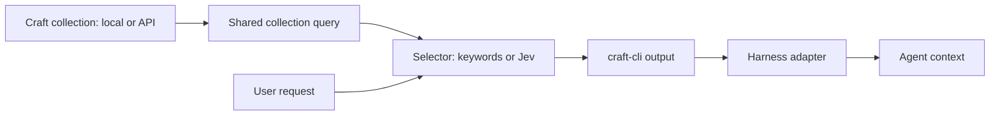

# Canonical Craft skills document, picker, and optional mirror

Date: 2026-10-08
Status: completed. Shipped in 0.9.0; final OP update and subsequent end-to-end checks passed. Pavel authorized implementation and release on 8 October 2026. Full skill folders ship in v1. GitHub publication is explicit configuration, pull request by default, direct commit optional.
Issue: [craft-cli #6](https://github.com/pa1ar/craft-cli/issues/6)
Craft: [plan](craftdocs://open?spaceId=8ac88104-eb82-9c72-9014-d28fdea88b25&blockId=7c4a39ac-da5a-6ead-0dea-4daaee17b22c), [Board card](craftdocs://open?spaceId=8ac88104-eb82-9c72-9014-d28fdea88b25&blockId=915c2c3e-7e8b-c18e-a838-cc0b839040d2), [research log](craftdocs://open?spaceId=8ac88104-eb82-9c72-9014-d28fdea88b25&blockId=2dc3c88f-acc5-e646-7f40-c19e7ba899b8).

## Product outcome

A user selects one Craft document as a canonical skills library. It contains a required collection and an optional introduction with setup and operating guidance. An agent prepares its shape by following the bundled craft-cli skill. Agents discover and load skills directly from this library. Users can optionally add a local mirror at any path, a GitHub target, and Jev ranking with their own key.

Craft owns the selected library's contents. Mirrors are generated outputs. Local and API modes provide the same functions and normalized skill contents. This feature belongs to craft-cli, independently of Lokki and of the separate two-way vault sync proposal.

## Earlier work and live findings

- The completed [19 September plan](2026-09-19-craft-skill-library.md), [second opinion](../../craft-skills-second-opinion-2026-09-19.md), and [portable contract](../../../skill/references/skill-library.md) cover `craft lib list/get/export`.
- The [Unslop pilot](../../skill-library-unslop-pilot-2026-09-19.md) verified live Craft retrieval, file validation, and explicit native Codex invocation. Automatic selection, multi-file packages, and GitHub sync were outside that pilot.
- Current implementation: `src/lib/skill-library.ts` validates metadata and fetches one selected body; `src/cli/commands/lib.ts` always uses the API and exports one new SKILL.md without replacing existing directories.
- Live check on 8 October: the existing collection contains 127 rows; normal discovery accepts 14 published skills and rejects one invalid name. Drafts and other kinds are excluded. Do not interpret all 127 rows as published skills.
- `lib get tend-board` and `lib get tend-skills` both fail on table blocks today. These skills are discoverable but cannot be loaded through the exporter. Broaden the shared renderer before claiming normal Craft skill compatibility.
- The current SKILLS document already contains an introduction and collection. The `tend-skills` note describes a future Craft-to-GitHub sync contract; no such production sync exists in current CLI code. Preserve its intent, then update the wording when behavior ships.
- `craft skills` already names a separate executable automation runner. Extend `craft lib`; preserve that existing command meaning.
- Craft Desktop's SQLite/PlainTextSearch adapters expose text and document metadata, but lack a reliable structured collection schema, membership, and per-block tree. Markdown tables are unsuitable as canonical row identity.
- Existing [Jev evaluation](../../jev-executive-evaluation-2026-09-28.md) found mixed reranking results and some gains for paraphrases and next-read advice. It used project-note tasks, not skills. A skill-specific evaluation is required.

## Research that affects this design

[Notion's announcement](https://www.notion.com/blog/a-skills-library-for-every-agent), published 17 September 2026, describes collaborative page editing plus portable delivery to agent tools. Its library can hold supporting folders and files, and GitHub is one delivery route.

[Notion's help](https://www.notion.com/help/create-and-manage-skills) distinguishes general instructions from task skills. A database provides descriptions used for automatic selection; attached files provide resources. Users can choose a skill explicitly. Manual downloads produce SKILL.md plus approved attachments, with a badge when the source changes.

[Notion's API](https://developers.notion.com/guides/agent-skills/overview) exports individual skills and grouped plugin directories. Listings contain identity, description, and version_id. Changed directories are downloaded through signed URLs. Removal is allowed only after a complete successful listing. Access follows the connection. Copy the separation between discovery, version checks, and full package download.

The official [GitHub sync starter](https://github.com/makenotion/notion-skills-github-sync) uses scheduled or manual GitHub Actions, scoped credentials, and a configurable target repository. Source inspection of `src/sync/plan.ts`, `src/target/github.ts`, and `.github/workflows/sync.yml` shows retained unchanged packages, source markers, and one atomic Git Data API commit per changed sync. Its workflow currently runs hourly. Separate engineering-owned skills can coexist with a generated library. Plugin marketplace manifests are useful for a named consumer, but need not define our initial file format.

[Anthropic's design](https://www.anthropic.com/engineering/equipping-agents-for-the-real-world-with-agent-skills) uses progressive disclosure: names and descriptions first, then the selected SKILL.md, then supporting files as needed. This is model-based selection from descriptions; these sources do not establish a hidden keyword threshold, vector index, or similarity algorithm. [Claude's guide](https://claude.com/resources/guides/the-complete-guide-to-building-skills-for-claude/fundamentals) confirms the three levels.

[TypeSafe's Jev overview](https://typesafe.ai/blog/introducing-system-one-models-and-jev) describes structured decisions from supplied context. Proposed use here: score skill relevance from bounded metadata and task context. A key alone does not establish a retrieval-quality gain.

## User flow and architecture



1. Setup selects a connection and document. It discovers collections inside that document. With multiple matching collections, the user or agent selects an explicit collection ID.
2. Validate or create the agreed schema through the API. Existing collections receive a reviewed migration; preserve unrelated fields, rows, and introduction text. Re-running setup must not duplicate anything.
3. Store the binding and optional guide block IDs. Return a small agent context with loader instructions and the selected library identity. A single loader skill makes direct API use available; GitHub and local export are optional.
4. One prepared query returns the eligible collection metadata. Pass this result plus the user request to the selected method, keywords by default or Jev with `--jev`. craft-cli validates selected IDs and emits one common output shape. Exact name/ID loading remains available.
5. Optional sync builds and validates generated files, reports changes, and updates only files it owns. GitHub publication uses the explicitly configured target and mode.

## Document and skill contract

Required fields keep the existing contract: title, stable unique `name`, `description`, `kind`, and `status`. Optional tags and source metadata remain supported. Normal automatic discovery uses `kind=skill`, `status=published`; drafts, prompts, and general instruction rows remain accessible through explicit inspection.

The introduction is editable library-level guidance. Read it once for setup/bootstrap and expose it separately from skill bodies. Never fetch the entire document and every skill merely to load this guide. Store explicit guide block IDs or a bounded guide section so collection content stays outside it.

For multi-file skills, use a supporting Resources collection inside each skill item: stable relative path, resource kind, and content or file reference. Text references can be editable page bodies; scripts and binary assets use attachments to preserve bytes. Load one resource by path on demand. The shape was verified in a live sandbox with reference, script and attachment bytes.

Use one renderer for headings, lists, quotes, callouts, code, separators, and tables. Resolve skill-to-skill and supporting-file links through registered IDs into portable paths. Leave ordinary Craft destinations as usable external links. Reject unresolved required resources or unsupported blocks before export; never silently omit instructions. Frontmatter remains the first bytes of SKILL.md; generated-source notices belong after it or in a manifest.

## Local/API parity contract

One Node-compatible library model validates, ranks, renders, and hashes both sources. Bun-only Desktop and snapshot storage stay in CLI adapters. API-only library exports remain usable by other consumers.

Proposed solution to the Desktop structure gap: an API-scoped, versioned local snapshot of the selected catalog, guide, fetched bodies, and resources. It is derived storage; Craft remains canonical. Build snapshots from complete API reads and commit them atomically. Preserve membership and resource IDs. Partition by resolved connection/account, document, and collection; an environment credential override must select a different scope.

Desktop caches may provide bounded change hints and eligible verified content. Use them only when identity, membership, and normalization are proven against the same source revision. Otherwise refresh through the API. Keep Desktop files read-only. Do not derive canonical exports or package hashes from flattened Desktop Markdown.

| Mode | Read behavior |
| --- | --- |
| auto / hybrid | Fast validated snapshot reads; bounded local probes; API refresh on missing, expired, or invalid content. Show provenance and age. |
| api | API reads and the same model; no Desktop dependency. |
| local | Available snapshot contents only; explicit misses for bodies/resources not yet cached. Complete offline use requires a prior full snapshot refresh. |

Guarantee parity for the same revision: catalog acceptance/rejection, guide, selected content, resource paths/bytes, deterministic keyword ranking, and package hashes. Jev results require a pinned model and recorded responses for reproducible comparison. Feature parity does not imply an offline snapshot contains a newer remote edit. Set and document an explicit freshness policy during the parity prototype; sync publication always starts with a complete API refresh. Connection access failures stop refresh/publication; stale/offline reading is an explicit policy, never a claim of current remote access.

## Retrieval

Pavel clarified the boundary on 8 October: Jev sits between craft-cli's collection query and craft-cli's output. craft-cli owns selection, including the non-Jev method. The goal is provider-agnostic skill selection that can feed harness hooks.

Proposed CLI, pending final naming:

```sh
craft lib pick "prepare the monthly invoice" --published --max-output 5 --json
craft lib pick "prepare the monthly invoice" --published --max-output 5 --jev --json
```

`--published` restricts the candidate query by status. For the new pick command, omitting it leaves status unrestricted among validated skill rows; return status explicitly. Existing list/get/export defaults remain published-only. Harness adapters and mirrors use published skills. `--max-output 5` caps the number of returned skills, not output characters. Fewer results, including zero, are valid. A separate `--budget` controls rendered content size.

1. Query the selected collection through the shared local/API function; apply explicit metadata filters and validation.
2. Send the same candidate records and request to the chosen selector. Records contain stable ID, name, description, tags, and status. Jev sees the complete eligible set; batch large sets within its limits and merge globally. Do not keyword-shortlist candidates before Jev or truncate the list to the output cap.
3. Keyword selection uses deterministic matching/ranking; `--jev` uses Jev relevance decisions. Validate outputs against candidate membership, remove duplicates, and apply the result cap after selection.
4. Return stable JSON with selected items, requested/used selector, revision, provenance, and rejection/fallback information. No-match is an ordinary empty list. stdout contains the result; diagnostics go to stderr.
5. Metadata output supports progressive body/reference retrieval. A proposed `--content` option returns only the selected bodies for prompt injection; resources remain demand-loaded. Never silently truncate a selected skill's rules: return its load command/path when the content budget cannot hold it.

Jev requires explicit selection by flag or saved adapter configuration; the presence of a key alone does not enable it. On provider failure, any keyword fallback is identified in output. Evaluate literal requests, paraphrases, multilingual requests, similar names, multiple applicable skills, and no-match cases against the same candidate sets. Freeze held-out cases before tuning. This compares selector quality; the main model no longer acts as the required catalog picker.

## Provider-agnostic harness integration

Keep the picker core independent of Codex, Claude Code, and model providers. An adapter reads the harness event, passes its prompt to `pick`, optionally loads selected bodies, and wraps the result in the harness's context output format. Optional Jev is a selector behind this common contract.

[Codex hooks](https://learn.chatgpt.com/docs/hooks) document `UserPromptSubmit` with prompt input and `additionalContext` output. The installed CLI is 0.160.0 and reports hooks enabled; actual adapter behavior still needs a fresh-session test. [Claude Code hooks](https://code.claude.com/docs/en/hooks#userpromptsubmit) also accept prompt input and added context. Hook availability is verified; no hooks are installed by this planning task.

For this library, keep the entire catalog outside native skill-discovery directories when using the hook route, so native selection does not run over the same library in parallel. Existing unrelated harness skills retain their settings. Native mirrors remain an alternative consumption mode. [Codex per-skill configuration](https://learn.chatgpt.com/docs/build-skills) and [Claude invocation controls](https://code.claude.com/docs/en/skills#control-who-invokes-a-skill) also provide ways to manage existing native copies, if a migration needs them.

The hook computes selection before the provider model sees the task. This replaces this library's discovery/selection stage; the provider model still interprets instructions and chooses tools. Avoid claiming the hook replaces the provider's full execution policy. Prefer injecting selected bodies when bounded; metadata-only injection still requires body reads, but not a second catalog selection.

Bound hook latency, use stable stdin rather than shell-interpolating user prompts, and supply selected bodies on each turn to survive compaction; avoid an irreversible session-level omission cache. Test prompt submission, repeated turns, resume/compaction, empty results, fallback, content budgets, and absence of duplicate native selection. Mid-task retrieval remains available through the same CLI contract when the task changes.

## Optional mirror and GitHub

Configure local destination, GitHub repository, branch, and repository subdirectory separately. Local files work without GitHub. API-to-GitHub delivery works headlessly without a permanent local folder. A user-selected folder can be outside craft-cli state, including a folder under ~/dev/skills. Existing hand-authored engineering skills keep their ownership.

Generate standard `<name>/SKILL.md` folders and optional resources. Track source item ID, package revision, and last-written hashes in a technical ownership manifest. Rename by stable item ID. Compute package revision from sorted relative paths and exact normalized bytes, including resources and metadata. Guide changes receive their own revision. Craft has no verified equivalent of Notion's version_id today; fetch/hash is the initial correctness baseline.

Stage a complete generation before replacement. Detect local or remote drift; report a conflict rather than overwrite independent edits. Preserve prior good outputs when listing, metadata validation, body fetch, or resource fetch fails. Remove owned files only after a complete successful listing and a valid removal decision. Keep an archive or Git recovery path. Refuse path traversal and writes through unexpected symlinks. Use one publication transaction and compare the remote branch base before advancing it. An unchanged run performs zero writes or commits.

Publication supports pull requests by default and direct commits by explicit configuration. Bind the chosen mode during setup so routine sync does not ask each time. GitHub credentials need write scope for the configured target. Keep keys outside Craft content and generated outputs. Manual sync is the baseline; optional local or GitHub scheduling calls the same command. No schedule is being installed during this planning task.

## Delivery plan

1. Implement the approved scope using `craft lib setup/status/guide/list/pick/get/resource/sync` as proposals; preserve existing commands and flag precedence.
2. Prototype collection/resources and parity with sandbox fixtures. First gate: the same API revision gives equal normalized local/API output and package hashes. Prove tables and linked reference loading with representative current skill shapes.
3. Implement document binding, idempotent schema setup, shared rendering, snapshot routing, freshness diagnostics, and metadata-first picker. Update bundled agent setup guidance and machine-readable discovery.
4. Implement complete staged mirror generation and the selected GitHub mode. Verify an arbitrary destination and a repo with unrelated hand-authored skills.
5. Add `--jev` behind the common selector contract and run the held-out selection evaluation. Keep the picker functional with no external classifier.
6. Build thin Codex and Claude Code prompt adapters, then verify fresh-session selection, context delivery, explicit invocation, and representative task behavior. Update the bundled skill and canonical authoring guidance. Run `bun run typecheck`, `bun test`, `bun run build`, and sandbox e2e flow checks. Move this plan to completed only after feature delivery, and update the issue, Board card, and daily evidence.

Functional checks must cover API-only/headless use, cold/warm local reads, uncached resources, stale snapshots, API failure, scope isolation, malformed/duplicate metadata, table rendering, reference rewrites, idempotent setup/sync, rename/archive/removal, changed attachments, incomplete listings, managed-file drift, symlinks, concurrent GitHub edits, and Jev failure. Prefer flow checks over new implementation-mirroring unit tests.

## Decisions used for implementation

Pavel authorized the complete build and release on 8 October. V1 delivers full skill folders. GitHub targets must be explicit, with PR publication by default and direct commits configurable. Keywords are the default selector; Jev remains explicit. Hook context includes bounded whole bodies and supplies them each turn so resume and compaction regain instructions.

The snapshot is API-derived because Desktop lacks structured collection membership. Auto freshness is 60 seconds; local is snapshot-only, API is headless. CLI bindings persist in ~/.config/craft-cli/libraries; cache files stay under ~/.cache/craft-cli/libraries. Resource collection text rows are self-contained files; nested page references are supported in the main skill tree. Each Resources row owns one explicit file path.

## Release and closeout, required

- Ship full packages, deterministic picker, optional Jev, local/API snapshots, managed local and GitHub sync, and prompt-hook adapters.
- Run the functional end-to-end suite, typecheck, existing tests, and binary build. Verify against live Craft and the released install.
- Bump minor version to 0.9.0, update the changelog, commit, tag, publish the GitHub release, and verify installation.
- Make an animation using the 1ar brand and publish the matching update on 1ar.io. Verify the public page and media.
- As the last operational step, update craft-cli OP on Craft with shipped behavior, release/site links, and verification evidence. Then run the final end-to-end smoke checks and report back.
- Update the Board card, issue, daily note, and canonical skill guidance; archive this plan under completed after delivery.

Chosen defaults after build authorization: full packages; keyword selection unless --jev; bounded body injection; explicit mirror path and GitHub target; PR mode by default with direct mode configured. No GitHub destination is inferred from the working directory.

## Verification before release

- Full suite: 228 pass, 28 credential-gated skips, 0 failures. Functional subprocess/HTTP/filesystem tests cover binding, picker, full exports, source parity, offline misses, mirrors, rename/archive, drift, symlinks and provider failure.
- Live Craft sandbox contains a guide, published/draft skills, tables, nested Policy, script and attachment. API and local hashes/bytes match. Unchanged local and GitHub syncs report no writes/commits.
- GitHub PR and direct modes both verified in an isolated private skills repo branch. Only synthetic QA paths changed.
- Jev initially exposed ambiguous array-index candidate references. Candidate-specific questions fixed this; six fixed synthetic cases then matched expected selections, keywords four of six. This small rerun is a smoke check, not a quality benchmark.
- Fresh Codex and Claude sessions received selected context and demand-loaded Policy, returning CRAFT_SKILLS_090_OK. Hook unavailable error paths allow prompts to continue. Codex test used explicitly enabled hooks and vetted inline config; trusted repo/global hook configuration requirements are documented.
- Canonical live collection fully refreshes all accepted published packages. One existing published CLAUDE.md row has an invalid skill name and remains rejected; publication stops until its owner fixes the metadata or kind. Existing manual engineering skills retain ownership.

Selected-body retrieval avoids eager attachment downloads. Resource reads download only the requested attachment; full refresh/export/sync fetch and validate complete folders.

## Delivery evidence

Shipped [0.9.0](https://github.com/pa1ar/craft-cli/releases/tag/v0.9.0), release commit cf24f4bd83c4f591cd728bf44f62bd88d667cf14. A fresh public-tag clone and install.sh built and installed the matching binary; doctor confirms connection, API and auto/local availability. This CLI has no --version flag: verify package version, release commit and resolved binary path. The initial installer invocation used the previous checkout; rerunning from the fresh tag restored the correct binary and the canonical harness skill link.

Released fresh Codex CLI and Claude Code sessions both returned the Policy marker through prompt-hook context and demand-loaded references. Released live API/local body and resource SHA and exact bytes match. Released local sync reports changed=[] and written=false. Synthetic GitHub PR and direct publication were verified; [QA PR](https://github.com/pa1ar/skills/pull/1) was closed and its temporary branch deleted without merging.

[Public update and brand animation](https://1ar.io/updates/craft-cli-0-9-0) deployed from website commit 24b38f0 to production dpl_743qPTka8yBVRNyxS5hm5oPgUxB1. Public routes return 200, media bytes match, and Chrome playback reaches readyState=4 with advancing time and no error. Website tracking: [issue 35](https://github.com/pa1ar/1ar.io/issues/35).

[Canonical authoring skill](craftdocs://open?spaceId=8ac88104-eb82-9c72-9014-d28fdea88b25&blockId=4ff88675-51d3-d01e-95ff-cd0d96afdff5) published in Craft, reviewed through export, and copied downstream to pa1ar/skills. The canonical library is bound with its existing guide; no destination or global hook is inferred. Existing invalid published CLAUDE.md metadata still blocks library-wide sync, while accepted skills remain readable and selectable.

Closeout order: Board, issue, daily, canonical guidance and site first; craft-cli OP last; final released end-to-end smoke afterward.

## Final closeout result

Website issue 35 and craft-cli issue 6 are closed. Board card is in Review. Daily and canonical guidance were updated first; craft-cli OP was the final operational update and its current callout, typed blocks, links and placement were read back. Other agents' blocks were preserved.

After that OP update, typecheck, compiled build and the full test suite passed again (228 pass, 28 credential-gated skips, 0 fail). The released live flow passed API/local byte and SHA parity, progressive reference retrieval, capped selection, unchanged sync, the canonical binding in both sources and public production routes. Canonical refresh completed with 17 published packages and guide ready offline. Fresh Codex CLI and Claude Code sessions then returned the expected Policy marker through the released hook/CLI flow. No global hook or inferred mirror target was installed.
