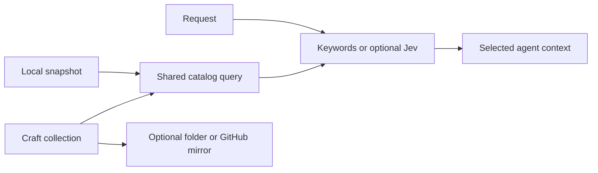

# Canonical skills from Craft

`craft lib` selects and delivers skills from a chosen Craft document. Craft is canonical. The document contains a skills collection and optional introduction. A scoped local snapshot gives fast or offline reads; an optional generated folder and GitHub target deliver standard skill packages.



```sh
craft lib setup --document DOCUMENT_ID --collection COLLECTION_ID --guide INTRO_BLOCK_ID
craft lib pick "prepare monthly invoices" --published --max-output 5 --json
craft lib pick "prepare monthly invoices" --published --max-output 5 --jev --json
craft lib get skill-name
craft lib resource skill-name references/policy.md
craft lib refresh --source api
craft lib get skill-name --source local
craft lib sync --out ~/dev/generated-skills --dry-run --json
```

An explicit `--collection ID` works without a binding. Select a private `--profile NAME` or public `--url URL`. Public URLs never receive saved credentials. Environment `CRAFT_URL` plus `CRAFT_KEY` overrides saved profiles. Guide IDs must be direct blocks outside the collection. `setup --create` creates an empty schema only when the document has no collections. Existing content and incompatible schemas require explicit authoring commands.

`list`, `get`, `export`, hooks and mirrors use published skills. `pick` without `--published` includes validated draft and archived skill metadata. `--max-output` counts skills after selection. No-match returns an empty list. `--content` returns complete selected SKILL.md bodies within a character `--budget`; a body that does not fit gets a load descriptor. Resources remain on demand.

Jev is explicitly selected with `--jev`. Set `JEV_API_KEY` or `TYPESAFE_API_KEY`. The request and eligible metadata go to TypeSafe, in bounded batches. All eligible candidates are evaluated before the global cap. Default model is pinned to `jev-1.13.0`; relevance >=0.55 selects a candidate. This is a practical initial threshold, not a calibrated quality guarantee. `--fallback` permits a labeled keyword fallback on a provider failure; without it, failure is explicit.

## Source parity

`auto` uses a validated snapshot for 60 seconds, then refreshes through API. Change the limit with `--max-age`. `api` always reads the remote catalog. `local` makes no Craft calls and reports uncached bodies/resources. `refresh` warms complete published packages plus the configured guide; add `--include-drafts` to warm those too. Offline snapshots can be older than Craft. JSON reports provenance, age, catalog revision and package hashes. A metadata refresh discards older bodies. Failed complete refresh preserves the previous snapshot.

Snapshots are partitioned by connection URL and credential hash, collection and normalization mode under `~/.cache/craft-cli/libraries`. Keys are not stored there. `CRAFT_LIB_STATE` overrides this technical state location. Bindings persist separately under ~/.config/craft-cli/libraries and contain document/collection/guide IDs and optional outputs, never API keys. Craft Desktop's flattened collection text is not used to infer canonical membership or file bytes. These library snapshots are separate from ordinary document reads.

## Packages and ownership

The [bundled contract](../skill/references/skill-library.md) defines fields and authoring. Text, code, separators, tables and link cards are supported. Nested pages become Markdown references. A `Resources` collection supplies explicit relative paths and text/script/file kinds. Scripts use one code block; files use one attachment. Ordinary attachments become `assets/<fileName>`. Export includes exact bytes, SHA-256 and deterministic package revision. Registered Craft links become relative links. Other Craft links stay external. Unsupported or missing required content stops generation.

`export --out DIR` creates a new `<name>/` folder and refuses existing folders. `sync --out DIR` updates a managed mirror anywhere the user selects. `.craft-skills.json` records owned files and hashes. Independent edits cause a conflict. Unrelated folders remain untouched. Full successful API reads are required before removing archived/renamed skills. Replaced folders are archived next to the destination under `.<folder>.craft-history`. A sync lock signals a running or interrupted transaction; inspect that transaction before removing the lock. An unchanged sync performs no writes.

```sh
craft lib setup --document DOCUMENT_ID --collection COLLECTION_ID \
  --github OWNER/REPO --branch main --repo-path skills --publish pr
craft lib sync --dry-run --json
craft lib sync --json
```

GitHub uses authenticated `gh`, with contents write and pull-request write for PR mode. Target repo, branch, folder and publication mode are explicit. PR is the default; `--publish direct` commits to the configured branch. Git Data API creates one atomic commit and rejects concurrent branch advances. Unrelated files are preserved. GitHub works without a permanent local folder. If both targets are set, each publication is a separate transaction; a failed second target can be retried. No schedule is installed. A scheduler can invoke the same command.

## Harness hooks

```sh
craft lib hook-config --harness codex
craft lib hook-config --harness claude --jev --fallback
```

Enable Codex hooks (`features.hooks=true` or `codex --enable hooks`), then merge the generated JSON into Codex `~/.codex/hooks.json` or repo `.codex/hooks.json`, or Claude Code settings. Repo hooks need a trusted project config; user-level hooks are a simple global route. Preserve other hooks. `lib hook` reads `UserPromptSubmit` JSON on stdin and returns `hookSpecificOutput.additionalContext`, with selected whole bodies or load descriptors. Prompts never enter shell command text. Hook mode keeps this library outside native discovery directories; native mirror registration is an alternative. It replaces selection for this library while the harness model executes the task. Whole selected bodies are supplied each turn so resumed or compacted conversations regain their instructions. Unavailable library reads produce an empty context and a diagnostic, allowing the prompt to continue. Library network calls have short timeouts and the generated hook has a 20-second harness timeout.

[Codex hook contract](https://learn.chatgpt.com/docs/hooks), [Claude Code hook contract](https://code.claude.com/docs/en/hooks#userpromptsubmit).

Published filters discovery, not access to the raw API. Keep private material outside a consumer connection. Skill contents guide the authorized task; they cannot authorize unrelated actions. No script is executed by these commands.
